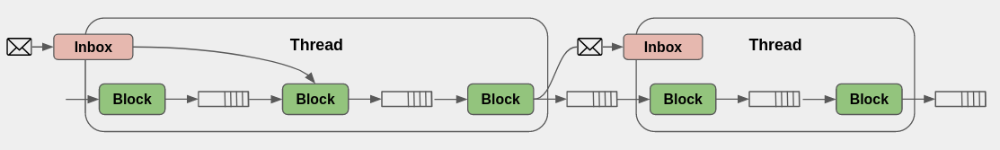

# Schedulers

Reference [commit](https://github.com/gnuradio/newsched/commit/f008524aa786270519faefb409a611c3367994be)

In this section we will discuss the common interface into schedulers, not any specific implementation of scheduling

A scheduler - derived from `class scheduler` - has a fairly simple interface that could foreseeably evolve as more schedulers are implemented.  We will take a look at the current interface:

### Constructor
Just a name for the instantiated scheduler.  Anything more will be done in the derived scheduler class

### Initialize
Take in a flattened graph (reduced down to nodes, no hierarchial graphs), and initialize the scheduler.  This could be allocating memory, setting up hardware, starting threads, etc.  The implementation is very dependent on the platform and the processing domain.  

### Start/Stop/Wait
Should be used set the execution state.  Since we are designing for distributed flowgraphs, execution is also managed by a higher level controller that will be discussed in a different section

### set_default_buffer_factory
This is used to store the default buffer factory in case the edges of the graph passed into this scheduler do not specify

### push_message

Used for entities (flowgraph controller, other schedulers) to add action items or data messages onto the thread queues.  The scheduler can route these messages to the various threads and put them on those queues if necessary.  `push_message` is just responsible for getting the message into the scheduler - implementation of the queues and getting it to the right thread queue is left up the implementation of the derived scheduler class.

## Scheduler Messaging

Each scheduler is assumed to have some number of threads, each thread blocking on a queue.  The items in the queue derive from `scheduler_message` and provide the following information:

### Message Type
Defined by an enum, to allow efficient downcasting to the specific message class

### Block ID
The block ID of the target block this message corresponds to

***Note: This needs to be expanded with ?portid? src and dst blockID*** 

