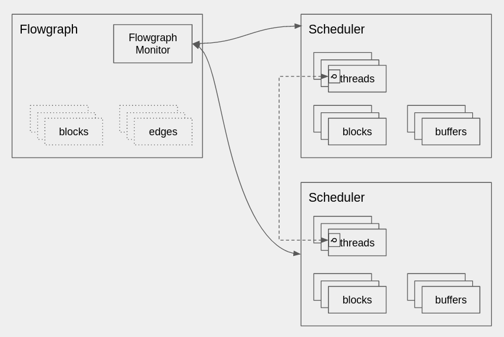

# Flowgraph Monitor

Reference [commit](https://github.com/gnuradio/newsched/commit/4bac0db0f9e35a929846791f81eae5902265bbc6)

The flowgraph monitor (fgm) is responsible for monitoring and managing the execution of the flowgraph across the schedulers that it has been partitioned to.



It communicates to the schedulers via the `push_message` method, and schedulers are instantiated with a pointer to a fgm object that they can use to push messages onto its queue.

## Concurrent Queue

`runtime/include/gnuradio/concurrent_queue.hh`

The concurrent queue class is a `std::deque` synchronized iwth condition variable to allow multiple producers and consumers, though only a single consumer is used in the current application.  This is a very simple implementation, and for usage elsewhere I'm sure gains could be found by using a different implementation.

Pushing onto the queue acquires the mutex, adds the message to the queue, and notifies the consumers that are blocking on the condition variable

```cpp
    bool push(const T& msg)
    {
        std::unique_lock<std::mutex> l(_mutex);
        _queue.push_back(msg);
        l.unlock();
        _cond.notify_all();

        return true;
    }
```

The pop is a blocking wait that acquires the mutex, waits to be notified, the returns the message

```cpp
    bool pop(T& msg)
    {
        std::unique_lock<std::mutex> l(_mutex);
        _cond.wait(l,
                   [this] { return !_queue.empty(); });
        msg = _queue.front();
        _queue.pop_front();
        return true;
    }
```

## FGM Operation
The FGM runs inside its own thread, and once the flowgraph is started (when the start() command is called through the schedulers), waits to be notified that the flowgraph is `DONE` or has been killed.

Sequence for normal termination of a flowgraph

1. One of the blocks inside the flowgraph returns `DONE` to its executor
2. FGM instructs _all_ the schedulers to be done by pushing a `DONE` message onto their queues
3. FGM waits for _all_ schedulers to signal they they are `FLUSHED` in that they have processed what is remaining in the buffers - the `FLUSHED` condition can be implemented differently per scheduler
4. All the schedulers are told to `EXIT` their threads

Sequence for canceled execution of a flowgraph (e.g. stop() is called)
1. TBD

More of the useful state sequences need to be flushed out.  Additionally the FGM could be useful for gathering statistics from the schedulers at a low enough data rate.