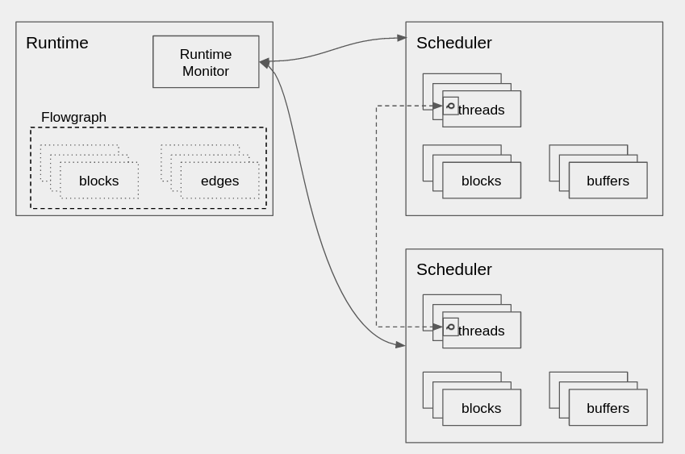

# Runtime

The runtime in GR 4.0 has been separated out as a different construct since in different applications a different manner of executing flowgraphs might be desirable (e.g. distributed flowgraphs).

The `runtime` object consists of the mechanisms for starting, stopping, and monitoring flowgraphs

## Using the runtime object

A flowgraph using the `runtime` object would be set up as follows:

```python
fg = gr.flowgraph()
# ... Set up blocks and connect them together
rt = gr.runtime() # or, a different runtime
rt.initialize(fg)

rt.run()
```

For convenience, the default `runtime` object is wrapped by the `flowgraph` object so normal usage can be done the same as in GR 3.x, but it is in effect doing the same thing as above

```python
fg = gr.flowgraph()
# ... Set up blocks and connect them together
fg.run()
```

## Runtime Monitor

The runtime monitor (rtm) is responsible for monitoring and managing the execution of the flowgraph across the schedulers that it has been partitioned to.



It communicates to the schedulers via the `push_message` method, and schedulers are instantiated with a pointer to an rtm object that they can use to push messages onto its queue.

The rtm also sequences the start and stop operation of all schedulers (and remote runtime proxies - described later in distributed operation) to ensure all components involved in the runtime are notified when one has a change in status (i.e. DONE)

## Concurrent Queue

The concurrent queue used by the rtm (and default scheduler) wraps the `moodycamel` implementation (https://github.com/cameron314/concurrentqueue).  There is nothing preventing a domain scheduler from using a different queueing implementation as the interface would be the same. 

## RTM Operation
The RTM runs inside its own thread, and once the flowgraph is started (when the start() command is called through the schedulers), waits to be notified that the flowgraph is `DONE` or has been killed.

Sequence for normal termination of a flowgraph

1. One of the blocks inside the flowgraph returns `DONE` to its executor
2. RTM instructs _all_ the schedulers to be done by pushing a `DONE` message onto their queues
3. RTM waits for _all_ schedulers to signal they they are `FLUSHED` in that they have processed what is remaining in the buffers - the `FLUSHED` condition can be implemented differently per scheduler
4. All the schedulers are told to `EXIT` their threads

Sequence for canceled execution of a flowgraph (e.g. stop() is called)
1. TBD

More of the useful state sequences need to be flushed out.  Additionally the RTM could be useful for gathering statistics from the schedulers at a low enough data rate.