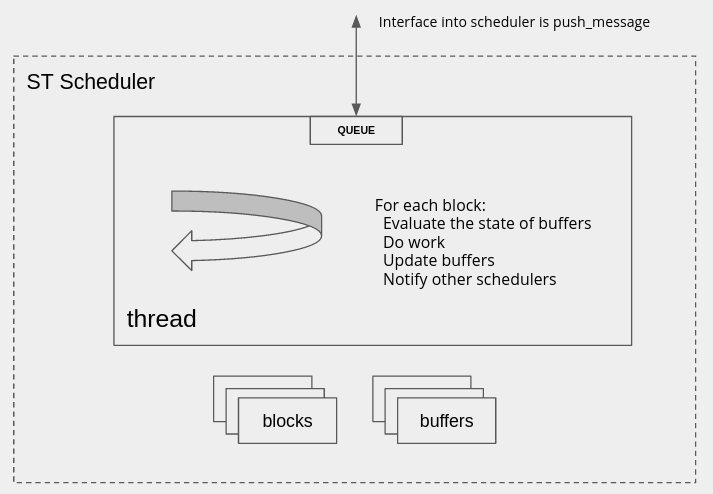

# The Single Threaded Scheduler

Reference [commit](https://github.com/gnuradio/newsched/commit/106f7074b36c3dc36d7f9f70afc61eca5a27cc00)

Now that we have seen how the scheduler interfaces to other things, let's implement a simple scheduler



As its name would indicate, the Single Threaded (ST) Scheduler has one thread that is going to try and do work on the blocks assigned to it.  First, let's look into the components that make up the ST scheduler

There is more to the ST scheduler when we start looking at interfaces between schedulers, but that has been stripped down as of this commit.

## Buffer Management
As mentioned in the [buffers](05_GraphsBuffers) section, the scheduler is responsible for allocating the buffers that are associated with the edges of the graph

The buffer manager:
1. looks through the edges in the graph
2. calls the custom or default buffer factory
3. catalogs the buffer with a reference to the edge to be used later

Another key operation of the buffer manager is setting the right number of items in each buffer.  Currently much of this logic from GNU Radio has been stripped out (output_multiple, interpolation rates, etc), but it is intended that the `get_buffer_num_items` will operate similarly and look upstream and downstream determining how large each buffer should be

## Graph Executor

The graph executor is directly analagous to `block_executor` in GR, the name change indicating that it is not just a single block in a thread, but a graph.  

### initialize
Construct with a pointer to the buffer manager, and a list of blocks

### run_one_iteration
This is called repeatedly from the thread when it is notified that there is work to be done.  In the case of the ST scheduler, it notifies itself!

The basic logic of `run_one_iteration` is:

1. For each block
1. Find the appropriate buffers that correspond to its ports
1. Query the input and output buffers for read/write availability
    - (is there work to be done)
1. If work is to be done, then call the `do_work` method with the constructed `work_input` and `work_output` structs
1. Update the buffers using the `post_read` and `post_write` methods
1. Handle tags somewhere in there as well
1. Return an enum with the status of each block

The status is similar to that from GNU Radio:

```cpp
enum class executor_iteration_status {
    READY,           // We made progress; everything's cool.
    READY_NO_OUTPUT, // We consumed some input, but produced no output.
    BLKD_IN,         // no progress; we're blocked waiting for input data.
    BLKD_OUT,        // no progress; we're blocked waiting for output buffer space.
    DONE,            // we're done; don't call me again.
};
```

If an output port of a block is connected to multiple input ports (of other blocks), a copy method is called since each edge has a unique buffer.  This is an over-simplification that needs to be fixed via a `buffer_reader` class, but is __not yet implemented__

```cpp
p_buf->copy_items(_bufman->get_input_buffer(p),
                    work_output[output_port_index].n_produced);
```

## Thread Wrapper
The thread wrapper is responsible for spawning the thread and handling messaging from the input queue which normally means calling the `graph_executor`

Execution is started by placing a `NOTIFY_ALL` message into the queue, which causes `handle_work_notification` to be executed, and in turn calls `graph_executor::run_one_iteration`

Execution is stopped by placing an `EXIT` message in the queue which gracefully exits the thread