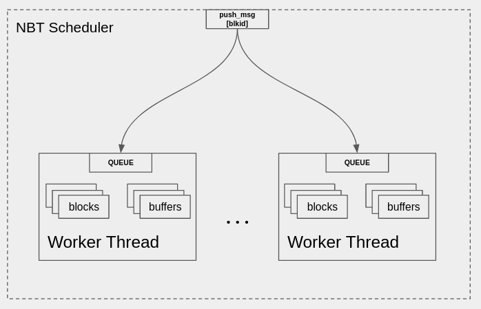

# The N Block Per Thread (NBT) Scheduler

The NBT Scheduler is analagous in functionality to the GNU Radio 3.x Thread Per Block (TPB) Scheduler.
In the case where blocks are not grouped, it defaults to the TPB model



The NBT scheduler creates a thread per block group.  Block groups are added to the NBT scheduler
by giving the scheduler a list of blocks in the `add_block_group` method
```
sched->add_block_group({blk1, blk2, blk3});
```
For each block group (and then each block that is in the flowgraph but not in a block group) a
thread will be launched to execute the blocks in that group.  You can see here that if no block 
groups are specified, there will be 1 block per thread.

## Thread Wrapper

The thread wrapper performs the following operations:
1. Block on input queue
2. Decode the message
3. Handle accordingly depending on the scheduler message
    - NOTIFY_{INPUT,OUTPUT}
        - Cause run_one_iteration to be called
    - DONE
        - Signal that a block requested flowgraph done, flush buffers and then notify FGM
    - EXIT
        - Immediately exit the thread (FGM signaled flowgraph completion
    - MESSAGE
        - Call the callback() method

## Graph Executor

This is *very* similar to GR Block Executor - perhaps over-simplified at this point
```cpp
run_one_iteration  // (someone told me i needed to do some work)
{
    foreach (b: blocks) ← // TODO intelligently decide the order of blocks to schedule
    {
        foreach (p: b.ports())
        {
            // how much buffer space available
            // prepare work_{input,output} 
        }
        {
        b.do_work()
        // adjust buffers, try again if necessary
        // update tags
        // update buffer pointers
    }
    }
    return status
}
```