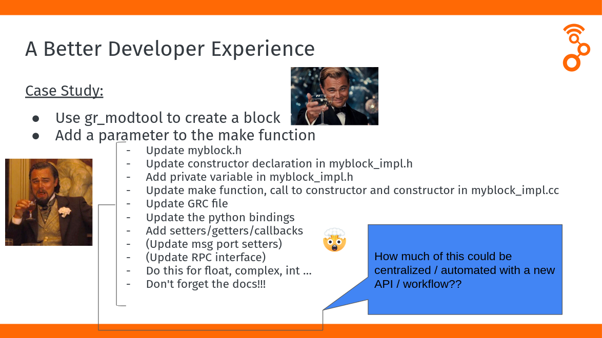
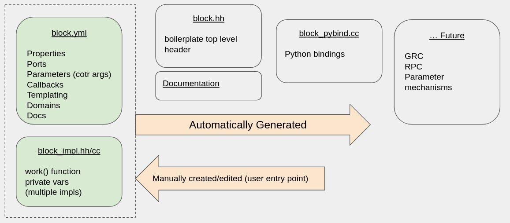

# YAML-based Block Development Workflow

Currently in GNU Radio there is a lot of boilerplate that the user has to do 
manually (after modtool is done) - e.g. add a parameter to the constructor
This becomes a barrier to people creating usable DSP in GNU Radio
With multiple implementations per block (CUDA, openCL, XRT, …), the block library grows in size and complexity



## Goals:
- multiple implementations 
- get the user to work() function quicker 
- minimize boilerplate through automation
- unify interfaces/mechanisms (constructor, setters, tags, RPC, messages) via automation

## Development Workflow


We introduce a new development workflow that seeks to simplify the developer experience for creating and maintaining blocks.  At the heart of this is a `.yml` file that defines everything we need to know about the block.  This `.yml` file is then used to auto-generate as much of the boilerplate code as we can:
- Public Headers
- Python Bindings
- GRC Bindings
- Parameter Access Mechanisms

From this `.yml` file, [jinja2](https://jinja2docs.readthedocs.io/en/stable/) is used to generate the 
various code into the `build` directory

## Folder Structure
Another key aspect to this design workflow is keeping all related block files in a single folder.  
This has the benefit of not constantly navigating the source tree when working with a single block
```
math
├── multiply_const
│   ├── multiply_const_cpu.hh
│   ├── multiply_const_cpu.cc
│   ├── multiply_const_cuda.hh
│   ├── multiply_const_cuda.cc
│   ├── multiply_const.yml
│   └── meson.build
```
Inside the folder, multiple implementations for the block are maintained as desired.  No longer `_impl`, the
specific implementation is used to suffix the implementations

## YAML File Structure
At the top, information about this block is given.  The `module` and `block` fields are
used for class and namespace naming, the `label` for GRC, and the `blocktype` is used
to specify the parent class for the block.  This needs to match the exact derivative block
such as `sync_block` or `block`

```yml
module: math
block: multiply_const
label: Multiply Constant
blocktype: sync_block
```

Typekeys are used to template the block however many ways and also generate the 
GRC bindings accordingly.  The id field will be used in the auto-generated c++ as
the template parameter.  Multiple template parameters can be instantiated here also.
The `suffix` is added onto the name of the class and used for the python bindings

All of this assumes use of C++ types 

```yml
typekeys:
  - id: T
    type: class
    options: 
      - value: gr_complex 
        suffix: cc 
      - value: float
        suffix: ff 
      - value: int32_t 
        suffix: ii
      - value: int16_t
        suffix: ss
```
Each parameter has the ability to 
1) be part of the constructor
   - to not be part of the constructor, set `cotr: false`
2) have a setter and/or getter 
   - by default, no setter or getter
   - if settable is true, then both setter and getter are created
3) have a default value (and be optional in the constructor)

```yml
parameters:
-   id: k
    label: Constant
    dtype: T
    settable: true
-   id: vlen
    label: Vec. Length
    dtype: size_t
    settable: false
    default: 1
```

Ports are used to autogenerate the instantiation of `port` objects.  These can be either typed or untyped.
In the typed case, the type can be either specified explicitly (e.g. `float`), or as a lookup to the typekeys

The dims can also be done as a lookup on one of the parameters using the `parameters/` notation

```yml
ports:
-   domain: stream
    id: in
    direction: input
    type: typekeys/T
    dims: parameters/vlen
-   domain: stream
    id: out
    direction: output
    type: typekeys/T
    dims: parameters/vlen
```

Implementations specify how the make function for the block will call the underlying implementation.
An enum is created for each implementation, and that is used as the last parameter to a block level
make function.  This make function is used to call the implementation specific make function in 
the block implementation.

```yml
implementations:
-   id: cpu
-   id: cuda
```

Some hacks are currently in place to generate GRC files from this yml.  Most of this could be
autogenerated but is left as a separate section for simplicity

```yml
grc:
  flags: [python]
  asserts:
    - ${ num_inputs > 1 }
    - ${ vlen > 0 }
  templates:
      imports: from newsched import math
      make: math.multiply_const_${T.fcn}(${k},${vlen})
```
Just like GRC, version the file - this is currently unused

```yml
file_format: 1

```

## meson.build

The `meson.build` specifies how the autogenerated targets will be created

A python script is called (`process_folder.py`) which renders the jinja templates according 
to the block yml.  The result is a bunch of code that lives in the `build/` directory
