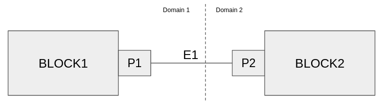

# Domain Adapters

With the Single Threaded scheduler, and all the blocks in the flowgraph assigned to the one thread, we didn't have to worry about communicating anything to any other schedulers or threads.  

In this section, we will be implementing the mechanism through which a flowgraph can be broken up across different schedulers.

## Terminology

|        |     |
| :-----------    | :---------- |
|  Custom Buffer      | mechanism to extend custom/optimal memory management into scheduler.  Primarily useful for heterogeneous devices   |
|  Domain    | portion of flowgraph mapped to a specific  scheduler       |
|  Domain Adapter          | presents as buffer representation for communicating and synchronizing memory/data across domain boundaries       |
|  Domain Crossing          | presents as buffer representation for communicating and synchronizing memory/data across domain boundaries       |

## Custom Buffers
We explored the implementation of custom buffers previously.  By adhering to the `buffer` API, custom buffers can extend the functionality of a scheduler to have more device-specific memory management

## Domains


Imagine we have a flowgraph that is going to run on a platform with various processing elements - perhaps a CPU, a GPU, and and FPGA.  We want to use the concept of domains to break up the flowgraph and run it on those different processing elements.

Each domain is assumed to be running a single scheduler instance (which may have multiple threads).  For some domains, such as blocks running on cpu, the role of the scheduler is straightforward.  For other domains, the scheduler may just be there to copy and monitor data transfer in and out of the device memory.

### Domain Crossings
When an edge in the graph crosses the boundary between domains, we must handle that edge as a "domain crossing".  

## Domain Adapters
Domain adapters are nodes that get connected in a graph behind the scenes when a domain crossing is detected, and provide an alternate path for the buffer API to retrieve the correct pointers (or data).  These could be communicated directly by passing pointers, or data passed over ZMQ, for example.  The point is that the edge between a domain adapter and a block appears inside a scheduler as a normal edge and access to the buffer API is the same.

Consider the case where a flowgraph is constructed with 4 blocks, 2 of which are in one domain and 2 in another.


In order to handle the domain crossing, domain adapters are added to the flowgraph (behind the scenes), and the buffer for that edge is managed by one of the domain adapters.  The Domain adapter that hosts the buffer will always act as a server in the pair connection with `buffer_location` set to `LOCAL` and the other domain adapter which will need to query the other domain adapter will be denoted as `REMOTE`

```cpp
enum class buffer_location_t { LOCAL = 0, REMOTE };
```
The Domain Adapter is both a node in that it is connected to blocks at the edges of a
subgraph as well as a buffer, since it is used for the scheduler to get the address
needed to read from or write to

```cpp
class domain_adapter : public node, public buffer
```
It holds a pointer to a buffer object which may be null if the adapter is not hosting
the buffer and relying on its peer to host the buffer
```cpp
    buffer_sptr _buffer = nullptr;
```

### Domain Adapter Configuration
Domain adapters also provide a configuration object that will generate a pair of domain adapters according to the specified parameters

```cpp
class domain_adapter_conf
```
Each derived Domain Adapter configuration needs to provide a `make_domain_adapter_pair` method to return a pair of domain adapter objects according to the configuration.  

```cpp
virtual std::pair<domain_adapter_sptr, domain_adapter_sptr>
make_domain_adapter_pair(port_sptr upstream_port, port_sptr downstream_port, const std::string& name="")
{
    throw std::runtime_error("Cannot create domain adapter pair from base class");
};
```

### Domain Adapter Direct 
This is a specific implementation of domain adapters used in the case where both schedulers have access to the same memory space and buffer pointers can be directly exchanged


Since Domain Adapters come in pairs, there needs to be an implementation of both client (querying the buffer) and server (hosting the buffer)
```cpp
class domain_adapter_direct_svr : public domain_adapter
```
```cpp
class domain_adapter_direct_cli : public domain_adapter
```
The `direct_sync` object simply provides a crude method for using a mutex protected sequence of events through an atomic integer to follow the communication sequence between the `cli` and `svr`

```cpp
direct_sync_sptr p_sync;
```

Like any other block, when a Domain Adapter is created, it must create ports in order to connect to other things.  In its make function, a pointer to the port of the block that it will be attaching to inside the same domain.

```cpp
// For domain adapter server
public:
    static sptr make(direct_sync_sptr sync, port_sptr other_port)
    {
        auto ptr = std::make_shared<domain_adapter_direct_svr>(sync);

        if (other_port->direction() == port_direction_t::INPUT) {
            ptr->add_port(untyped_port::make("output",
                                             port_direction_t::OUTPUT,
                                             other_port->itemsize(),
                                             port_type_t::STREAM));
        } else {
            ptr->add_port(untyped_port::make("input",
                                             port_direction_t::INPUT,
                                             other_port->itemsize(),
                                             port_type_t::STREAM));
        }

        ptr->start_thread(ptr); // start thread with reference to shared pointer

        return ptr;
    }
```

### Communication Sequence
Once the pair of domain adapters instantiated and used in a scheduler (since they are used as a buffer), the client DA calls `get_remote_buffer` method, and the sync object is used to signal the information from the shared variables in that object from the server DA.  

1. __[CLI->SVR]__ Give me your buffer pointer
1. __[SVR->CLI]__ OK, here it is (in `p_sync`)
1. __[SVR]__ Now CLI has it, so I can exit the thread
2. __[CLI]__ From now on I can just use buffer pointer that I just got directly

### Domain Adapter Configuration Implementation

The terminology surrounding domain adapters is incredibly confusing and overloaded.  Below is the factory to generate a pair of domain adapters for the `direct` flavor of DAs.  

Let's consider the simplest block configuration that crosses a domain boundary



In this case `BLOCK1` port `P1` is connected to `BLOCK2` port `P2` over edge `E1`.  When calling the factory for a DA pair, `upstream_port` in this case would be `P1`, `downstream_port` `P2`.  

Once Domain adapters are inserted into the flowgraph, we have a side-channel connection of sorts between DA1 and DA2 which bypasses the port to port connection that was previously configured.  This insertion will happen later, but gives a visual depiction of where the DAs fit in.


If the buffer preference of the configuration object is `DOWNSTREAM` then the buffer will be hosted in Domain 2, and associated with newly created `E4`, but this doesn't happen until later.  If the buffer preference is `UPSTREAM` then the buffer will be hosted in Domain 1 and associated with edge `E3`, and DA1 will be configured as server and DA2 as client.

```cpp
virtual std::pair<domain_adapter_sptr, domain_adapter_sptr> make_domain_adapter_pair(
    port_sptr upstream_port, port_sptr downstream_port, const std::string& name = "")
{
    auto direct_sync = direct_sync::make();

    if (_buf_pref == buffer_preference_t::DOWNSTREAM) {
        auto upstream_adapter =
            domain_adapter_direct_cli::make(direct_sync, upstream_port);
        auto downstream_adapter =
            domain_adapter_direct_svr::make(direct_sync, downstream_port);
        return std::make_pair(downstream_adapter, upstream_adapter);
    } else {
        auto downstream_adapter =
            domain_adapter_direct_cli::make(direct_sync, upstream_port);
        auto upstream_adapter =
            domain_adapter_direct_svr::make(direct_sync, downstream_port);
        return std::make_pair(downstream_adapter, upstream_adapter);
    }
}
```
