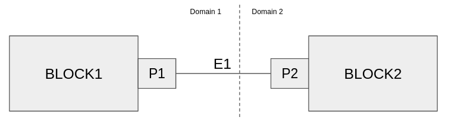

# Inter-Scheduler Interfaces

In a flowgraph that uses multiple schedulers, these schedulers must communicate with each other through the input queues of their threads, notifying each other when work has been done amongst other things

Previously, we had given a scheduler a `push_message` method. Let's generalize this now to a `neighbor_interface` class from which schedulers will derive.  Note that this interface only has one method `push_message` which is the only way to communicate with a scheduler.

```cpp
struct neighbor_interface
{
    neighbor_interface() {}
    virtual ~neighbor_interface() {}
    virtual void push_message(scheduler_message_sptr msg) = 0;
};
```
In order to incorporate the `neighbor_interface` with the schedulers we will
1. Derive from neighbor interface

(`runtime/include/gnuradio/scheduler.h`)
```diff
-class scheduler : public std::enable_shared_from_this<scheduler>
+class scheduler : public std::enable_shared_from_this<scheduler>, public neighbor_interface
```
## Partitioning the Flowgraph
The burden is not on the user to create all these hidden connections such as Inter-Scheduler interfaces, so we take the simply-created flowgraph with blocks and edges, and partition it across the specified schedulers

### User Configuration
Say the user wants to create a simple flowgraph which is `src->block1->block2->snk`, and there is a domain boundary between `block1` and `block2`.  The user needs to provide the following to inform the flowgraph partitioning where the blocks should go

First, create the scheduler objects - these could be different domain schedulers, but for now we will just use the default scheduler
```c++
    auto sched1 = schedulers::scheduler_nbt::make("sched1");
    auto sched2 = schedulers::scheduler_nbt::make("sched2");
```

Next, create the runtime object and add the schedulers to it.  The `initialize` method will handle the partitioning across the schedulers
```c++
    auto rt = runtime::make();
    rt->add_scheduler({ sched1, { src, mult1 } });
    rt->add_scheduler({ sched2, { mult2, snk } });
    rt->initialize(fg);
```
... and run the flowgraph (via the runtime) as usual

```c++

    rt->start();
    rt->wait();
```

### Partitioning the graph
The flowgraph object is now responsible for breaking up the user flowgraph into smaller subgraphs.  Inside `flowgraph::partition`, the bulk of the work to this end is being done by `graph_utils::partition`, and there is a lot going on in this method, which takes in the graph, the schedulers, the domain confs and returns an information struct about the partitioned graph

```cpp
static graph_partition_info_vec
partition(graph_sptr input_graph,
            std::vector<scheduler_sptr> scheds,
            std::vector<domain_conf>& confs);
```
The `partition` method performs the following

1. Create the subgraphs from the nodes that are cohesive in each domain
    - In the example above this would create `subgraph[0]` with `src` and `block1`, then `subgraph[1]` with `block2` and `snk`
2. Save the edges that crossed domains
    - Such as the edge between `block1` and `block2`
3. Add any orphan nodes into the appropriate subgraph, even though they are not directly connected but are encapsulated by the domain definition
4. Set up _Inter-Scheduler Interfaces_ from the saved domain crossings from step (2)

Let's look at step (4) in more detail, and use the connection between `block1` and `block2` as the example


For each detected crossing, we need to 
- Find the `src` and `dst` nodes from the stored subgraphs (some brute force searching)
```cpp
    for (auto c : domain_crossings) {
        // Find the subgraph that holds src block
        graph_sptr src_block_graph = nullptr;
        for (auto info : ret) {
            auto g = info.subgraph;
            auto blocks = g->calc_used_nodes();
            if (std::find(blocks.begin(), blocks.end(), c->src().node()) != blocks.end()) {
                src_block_graph = g;
                break;
            }
        }

        // Find the subgraph that holds dst block
        graph_sptr dst_block_graph = nullptr;
        for (auto info : ret) {
            auto g = info.subgraph;
            auto blocks = g->calc_used_nodes();
            if (std::find(blocks.begin(), blocks.end(), c->dst().node()) != blocks.end()) {
                dst_block_graph = g;
                break;
            }
        }

        src_block_graph->add_edge(c);
        dst_block_graph->add_edge(c);
```

When these edges are added, the port objects that are connected get a reference to each other. 