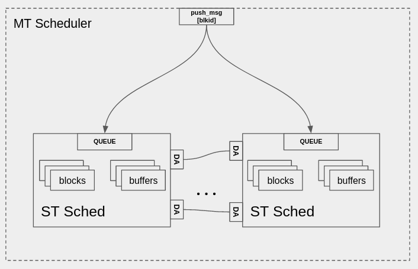

# The Multi-Threaded Scheduler

In essence, the Multi-threaded (MT) Scheduler is simply a bunch of ST schedulers joined together with Domain Adapters.  If no "block groups" are specified, the behavior of the MT scheduler will set up 1 ST scheduler per block, which is equivalent to a TPB scheduler.



## Block Groups

The `scheduler_mt` class has a simple method for grouping the blocks that should be a part of one thread.

```cpp
 void add_block_group(std::vector<block_sptr> blocks);
```

After the scheduler is constructed, just give this method a vector of the `block_sptr`s, and the initialization will get them to the right place.

## Initialization

The interface to the MT Scheduler is the same as the ST scheduler in that it has a `push_message` and `initialize` method, but a little bit more is done behind the scenes to partition the graph and create the individual ST schedulers from the block groupings

The initialization function of the MT scheduler must

1. Create a thread for each specified block group
2. Create a thread for each block that is not part of a block group
3. Account for domain adapters that may be present in the subgraph
    - Append these to a list

A domain configuration in dconf is created here with all the blocks from the block group, and the domain adapters that might have been attached - which will be used for an ST scheduler.
```cpp
// look at our block groups, create confs and remove from blocks
for (auto& bg : _block_groups) {
    if (bg.size()) {
        std::vector<node_sptr> node_vec;
        for (auto& b : bg) { // domain adapters don't show up as blocks
            auto it = std::find(blocks.begin(), blocks.end(), b);
            if (it != blocks.end()) {
                blocks.erase(it);
                append_domain_adapters(b, fg, node_vec);
            }
        }

        auto st_sched = scheduler_st::make(bg[0]->name(), s_fixed_buf_size);
        scheds.push_back(st_sched);
        dconf.push_back(domain_conf(st_sched, node_vec, da_conf));
    }
}
```
Likewise, an ST scheduler is created (with DA configuration) for every block that was not part of a block group


Using the same  `partition` function as before, the flowgraph passed into the MT scheduler is busted up across the ST schedulers, and these are initialized accordingly.

```cpp
auto partition_info = graph_utils::partition(fg, scheds, dconf, block_sched_map);

for (auto& info : partition_info) {
    auto flattened = flat_graph::make_flat(info.subgraph);
    info.scheduler->initialize(flattened, fgmon, info.neighbor_map);
    _st_scheds.push_back(info.scheduler);

    for (auto& b : flattened->calc_used_nodes()) {
        _block_thread_map[b->id()] = info.scheduler;
    }
}
```

## Flowgraph Monitor
```cpp
fgmon->replace_scheduler(base(), scheds);
```

The Flowgraph monitor adds an additional method to replace schedulers that were given to it.  This is done as a shortcut (possibly a hack) to not have to route the inter-scheduler messages at the interface of the MT scheduler and handle all the sub-scheduler coordination.  

Instead, the individual ST schedulers that are housed by the MT scheduler _replace_ the MT scheduler in the flowgraph monitor.  They are truly independent, and MT is just a way to set them up.

## User Configuration

We create some simple QA tests that show the configuration of the MT scheduler

### qa_scheduler_mt
The tests in `qa_scheduler_mt` are exactly the same as the ones under ST Scheduler tests, except the ST is replaced by the MT.

In these cases the MT scheduler will default to TPB behavior.

### qa_block_grouping

We test here variations on the number of groups and configured blocks using the `scheduler_mt::add_block_group(bg)` method