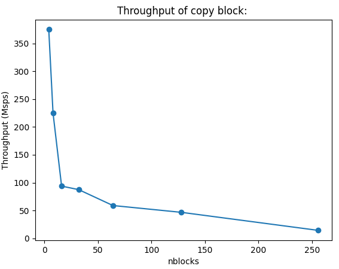
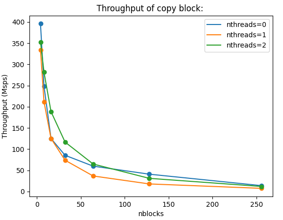

# Benchmarking

This is not an exhaustive description of how to benchmark GNU Radio and scheduler, rather a short description of some of the mechanisms that are included in-tree to be able to make apples to apples comparisons between variables in newsched and between newsched and GNU Radio (or other SDR frameworks).

For a more thorough consideration of benchmarking GNU Radio see [gr-sched](https://github.com/bastibl/gr-sched) and the associated [paper](https://www.bastibl.net/bib/bloessl2019benchmarking/bloessl2019benchmarking.pdf) and [blog](https://www.bastibl.net/gnuradio-performance-1/)

As you will see, we use some of the concepts from Bastian Bloessl's work to standardize how basic throughput testing could be done in-tree

## vmcircbuf

In order to be able to compare GR with newsched, we need to make sure that we have the same doubly mapped circular buffers since up to this point we have only been using simple circular buffers.  For the most part, this code is copied over from GNU Radio.

The `vmcircbuf` base class is just like `simple_buffer` except it doesn't need to do the second copy as it uses the OS mechanism to have that transparently mapped (in the derived classes).

Also, just like the `cudabuffer` class, there is a buffer_properties class, and a factory, which based on the preferences, will call the appropriate factory from one of the derived classes.  

Two of the derived classes are copied over at this point: `vmcircbuf_sysv_shm` and `vmcircbuf_mmap_shm_open`.  Not yet implemented, but the plan is to have newsched test which one of all the possible choices works the best on a given system, and store that in the preferences.

In order to have all the conditional compiling necessary, more logic needed to be added to `runtime/lib/meson.build` to detect which headers will compile on the target platform.

## More blocks

Also, to set up for benchmarking, more blocks are added

- Copy
- Null Source
- Null Sink
- Nop (just like copy, but doesn't actually perform the copy)
- Nop Source (just like null source without the memcpy)
- Head, Nop Head
- Fanout (to test 1:N connections)

## Benchmarking

The executables for benchmarking are named `bm_xxx` and live in `bench` directory under the scheduler that they use.  There may be top level benchmark scripts in the future if the scheduler is a selectable parameter

The premise is very simple
- Single execution of a flowgraph with command line parameters
- Uses `std::chrono` to time from `start()` to the end of `wait()`
- Print a tag with the time to the console
- Print other tags as desired 
    - `[PROFILE_TAGNAME]value[PROFILE_TAGNAME]`

```c++
auto t1 = std::chrono::steady_clock::now();

fg->start();
fg->wait();

auto t2 = std::chrono::steady_clock::now();
auto time =
    std::chrono::duration_cast<std::chrono::nanoseconds>(t2 - t1).count() / 1e9;

std::cout << "[PROFILE_TIME]" << time << "[PROFILE_TIME]" << std::endl;
```

These executables are intended to be called from a script that can iterate over the command line parameters with cpu shielding set up.  I have been using the [gr-bench](https://github.com/mormj/gr-bench) repository, specifically `iterate_flowgraph.py`

For this script, each command line parameter exposed in the benchmarking application can be given multiple values, over which `itertools` is used to run it with all the combinations and store the results.  Taking a look at `schedulers/mt/bench/bm_copy.cpp`, we have the following input parameter:

```
Basic Test Flow Graph:
  -h [ --help ]             display help
  --samples arg (=15000000) Number of samples
  --veclen arg (=1)         Vector Length
  --nblocks arg (=1)        Number of copy blocks
  --nthreads arg (=0)       Number of threads (0: tpb
  --buffer arg (=1)         Buffer Type (0:simple, 1:vmcirc, 2:cuda, 
                            3:cuda_pinned
  --rt_prio                 Enable Real-time priority
```

An example of running this with `iterate_flowgraph` this would be
```bash
python3 iterate_flowgraph.py time bm_mt_copy --vars samples:[100000000,] nblocks:[4,8,16,32,64,128,256] --noshield
```
Each iteration will spit out the time it took with the give params, such as

```
[PROFILE_TIME]6.98143[PROFILE_TIME]
```
And the resulting results file is shown in the following statement
```
To plot, run: 
 python3 /share/gnuradio/gr-bench/utils/plot/plot_single.py /share/gnuradio/gr-bench/apps/results/bm_mt_copy_results_212801_152151.json -x nblocks -y tput
```

The plotting requires `matplotlib`, but should generate something like this (adding a `--title`)



If we add another iteration variable in the benchmarking, we can add multiple series to the plot:

```
python3 iterate_flowgraph.py time /share/gnuradio/newsched/build/schedulers/mt/bench/bm_mt_copy --vars samples:[100000000,] nblocks:[4,8,16,32,64,128,256] nthreads:[0,1,2,] --noshield
```
```
 python3 /share/gnuradio/gr-bench/utils/plot/plot_single.py /share/gnuradio/gr-bench/apps/results/bm_mt_copy_results_212801_153158.json -x nblocks -y tput --series nthreads --title "Throughput of copy block"
```

