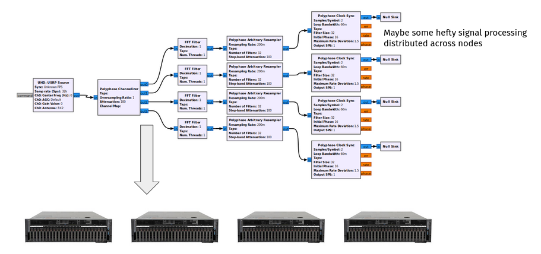
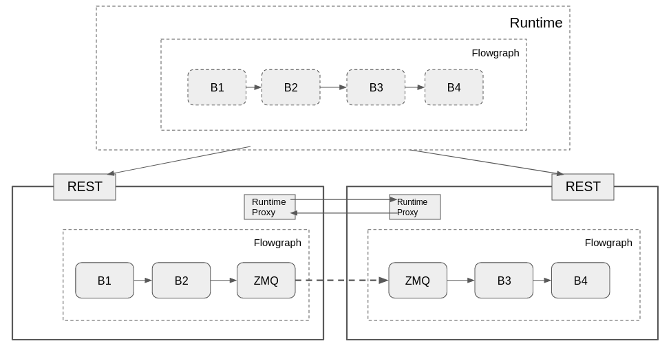

# Distributed Operation

One of the main goals of newsched is to support architectures that span multiple nodes.  Imagine a distributed DSP problem where a channelization is done up front, but then some further signal processing is performed on different machines, perhaps with GPUs.  This is possible with GR3.x with the use of networking or ZMQ blocks, but requires a higher level of orchestration to manually configure all the moving pieces.  



The design goal of distributed operation in newsched is to be able to 
1) Create a flowgraph like you normally would
2) Instruct the runtime to put different parts of that flowgraph on different resources
3) Keep the runtime modular so very different and unforeseen designs can be accomodated by use of custom runtime implementations

In theory, the distribution across resources could be done automatically, but we are not going to address that for now.

## Runtime Example Flowgraph

Let's take a look at how a flowgraph might be used in distributed operation

```python
import os
from gnuradio.runtimes import distributed 
from gnuradio import blocks, math, gr
```

First, we see that we import a distributed runtime, which could live out of tree.  This one (`distributed`) happens to be in-tree as an example under `runtimes/distributed`

Everything with setting up the flowgraph is as normal - we are configuring a flowgraph object with 5 blocks as if we are running on a single host.

```python
# An example of distributing a flowgraph across remote nodes
# These nodes could be containerized and/or live on remote hosts

nsamples = 1000
# input_data = [x%256 for x in list(range(nsamples))]
input_data = list(range(nsamples))

# Blocks are created locally, but will be replicated on the remote host
src = blocks.vector_source_f(input_data, False)
cp1 = blocks.copy()
mc = math.multiply_const_ff(1.0)
cp2 = blocks.copy()
snk = blocks.vector_sink_f()

fg1 = gr.flowgraph("FG On Local Host")
fg1.connect([src, cp1, mc, cp2, snk])
```

But by configuring the runtime, we can assign blocks to the different resources defined in `test_config.yml`.  Again this is just a basic example of how a runtime could be implemented - there is no fixed API for a runtime.  Inside `test_config.yml`, two remote hosts are defined - `newsched1` and `newsched2`.  The interesting part happens when rt1.initialize() is called

```python
with distributed.runtime(os.path.join(os.path.dirname(__file__), 'test_config.yml')) as rt1:
    # There are 2 remote hosts defined in the config yml
    #  We assign groups of blocks where we want them to go
    rt1.assign_blocks("newsched1", [src, cp1, mc])
    rt1.assign_blocks("newsched2", [cp2, snk])
    rt1.initialize(fg1)
```

After `rt1` is initialized, block objects exist on the remote hosts since they have been configured over the RPC interfaces.  The blocks that we set up as part of the flowgraph locally can be considered "proxy blocks".  Calls to their methods will serialize the request to the appropriate remote host

```python
    # These calls on the local block are serialized to the remote block
    # This in effect means the local blocks are acting as proxy blocks
    mc.set_k(2.0)
    print(mc.k())
```

Execution of the runtime should look similar to a normal runtime execution, but again, implementation is left up to the runtime developer.

```python
    # Run the flowgraph
    rt1.start()
    rt1.wait()
```

```python
    # Get data from the block running on the remote host
    #  using the local block as a proxy
    rx_data = snk.data()
    print(f'Received {len(rx_data)} samples')
```
## RPC
To be able communicate to the distributed nodes, some form of RPC must be enabled.  This is generally left to the runtime developer, but a couple of methods are required from any rpc, as they are call from within block.h - see `gr/include/gnuradio/rpc_client_interface.h`) - if it is desired to make calls from "proxy blocks"

A simple REST interface is implemented (in python) in `rpc/REST/server/main.py`.  This interface uses `FastAPI` (https://fastapi.tiangolo.com/) and defines a single command - `execute` with a json payload.  

Inside each json payload is a `command` field that will execute the rest of the payload.  These commands consist of the set of instructions to be able to remotely create, configure, and control a flowgraph, such as:
```python
    def flowgraph_create(self, **kwargs):
    def flowgraph_start(self, **kwargs):
    def flowgraph_wait(self, **kwargs):
    def flowgraph_stop(self, **kwargs):
    def flowgraph_connect(self, **kwargs):

    def runtime_create(self, **kwargs):
    def runtime_initialize(self, **kwargs):
    def runtime_start(self, **kwargs):
    def runtime_wait(self, **kwargs):
    def runtime_stop(self, **kwargs):

    def block_create(self, **kwargs):
    def block_method(self, **kwargs): #block_name, method, payload):
    def block_parameter_query(self, **kwargs): #block_name, parameter):
    def block_parameter_change(self, **kwargs): #block_name, parameter, payload):
    def runtime_create_proxy(self, **kwargs): #rt_name, payload):
    def runtime_connect_proxy(self, **kwargs): #proxy_name, payload):
```

These are the methods that are invoked when the distributed.runtime object calls initialize on the flowgraph.  For convenience, there is also an RPC client for the REST RPC which wraps the https requests and makes the runtime code a bit neater.

As mentioned before, since blocks can become "proxy blocks" when their usage has shifted to a remote host, it is necessary to implement the following methods in an RPC in order to allow this.

```c++
    virtual void block_method(const std::string& block_name,
                              const std::string& method,
                              const std::string& payload);

    virtual std::string block_parameter_query(const std::string& block_name,
                                            const std::string& parameter);

    virtual void block_parameter_change(const std::string& block_name,
                                        const std::string& parameter,
                                        const std::string& encoded_value);
```

## Runtime


Inside the runtime object, there needs to exist the logic to determine what goes where and how to configure it.  In the above diagram, you can see the runtime on the local (top) has the normal flowgraph, but uses the REST interfaces to configure the partitions on the remote hosts.

### Flowgraph Partitioning

Since the block objects have been assigned internally to a map of hosts to blocks, we can use the `gr.graph_utils.partition` method to break up the flowgraph into subgraphs and edges that cross boundaries

```python
        partition_config =  [val for _, val in self.host_blocks_map.items()]
        graphs, crossings = gr.graph_utils.partition(fg, partition_config)
```

Now, once these subgraphs have been determined, the runtime calls the RPC methods to create and configure the flowgraph in each remote host

### Runtime Proxy Objects

It is important for flowgraph execution to be coordinated across all the remote hosts.  For instance in the above example, when `B1` says that it is `DONE`, it needs a way of telling the flowgraph on the second remote host to stop execution.  Runtime proxy objects are used by the Runtime Monitor (RTM) at the same level as the scheduler to interface to other known remote hosts.  The RTM will not allow the runtime to return from a `wait()` or `run()` until all it's configured schedulers and remote proxy objects have signaled that they are `DONE` as well

The current implementation of the runtime proxy is based on ZMQ bidirectional client server

### Streaming buffer serialization

For simplicity, in the example distributed runtime, breaking up a flowgraph across remote hosts is done by putting ZMQ PUSH PULL blocks at either end of a connection that crosses hosts.  Inside of `runtimes/distributed/python/runtimes/distributed/runtime.py` we see where to place these based on the `crossings` list of edges.

The blocks are created on the remote side (address should actually come from the configured parameters, but is hardcoded for now)

```python
                src_client = list(self.host_client_map.items())[graphs.index(src_graph)][1]
                randstr = uuid.uuid4().hex[:6]
                src_blockname = 'zmq_push_sink' + "_" + randstr
                src_client.block_create_params(src_blockname, {'module': 'zeromq', 'id': 'push_sink', 
                    'parameters': {'itemsize': c.src().port().itemsize(), 'address':"tcp://127.0.0.1:0"  }})
        
                lastendpoint = src_client.block_method(src_blockname, 'last_endpoint', {})
                dst_client = list(self.host_client_map.items())[graphs.index(dst_graph)][1]
                randstr = uuid.uuid4().hex[:6]
                dst_blockname = 'zmq_pull_source' + "_" + randstr
                dst_client.block_create_params(dst_blockname, {'module': 'zeromq', 'id': 'pull_source', 
                    'parameters': {'itemsize': c.dst().port().itemsize(), 'address': lastendpoint  }})
```

and connected
```python
            fgname = self.client_fgname_map[src_client]
            src_client.flowgraph_connect(fgname,
                                        (c.src().node().rpc_name(),
                                        c.src().port().name()),
                                        (src_blockname,
                                        "in"),
                                        None)
            fgname = self.client_fgname_map[dst_client]
            dst_client.flowgraph_connect(fgname,
                                        (dst_blockname, 
                                        "out"),
                                        (c.dst().node().rpc_name(),
                                        c.dst().port().name()),
                                        None)
```

### Message Port serialization
Message port connections are serialized in the same way - via ZMQ message blocks.  We rely on the `pmtf` object serialization methods to do this internal to the ZMQ message blocks.  A runtime could easily use a different block - any networked block that can get serialized data from one end to the other would work (Kafka, RabbitMQ??)