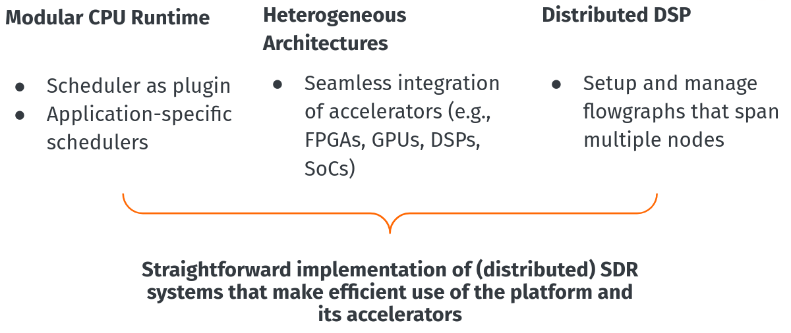

layout : page  
title : Intro to newsched
exclude : false  

<table><tr>
<th><b><a href="user_tutorial/01_Intro">User Tutorial</a></b></th>
<th><b><a href="dev_tutorial/01_Intro">Developer Tutorial</a></b></th>
</tr></table>

Newsched is intended to be a proving ground for concepts that will eventually
become the GNU Radio 4.0 Runtime

It is a clean-slate approach to write a GNU Radio runtime that works for humans -
by getting back to the basic principles

It is the attempt to create an SDR framework that is simple, yet flexible, and pleasant to develop applications with.  Much is leveraged / copied from GNU Radio, but we are not attempting to keep GNU Radio entirely intact either.

## GR 4.0 Runtime Vision

<!--  -->

The GR 4.0 vision is to be able to seamlessly utilize heterogeneous and distributed
hardware platforms by taking a modular runtime approach, all while maintaining the 
usability of GNU Radio that we have grown accustomed to.

### Modular CPU Runtime
The "scheduler" in GNU Radio as it is commonly called, refers to the mechanism that passes
samples between blocks in a flowgraph.  Currently GNU Radio only has 1 such "scheduler" which is
the Thread Per Block (TPB) scheduler which certainly has limitations and has not been updated much 
in most of the existence of GNU Radio.  

See [this](http://www.trondeau.com/blog/2013/9/15/explaining-the-gnu-radio-scheduler.html) for more info on the current GNU Radio Scheduler, and [this paper](https://www.bastibl.net/bib/bloessl2019benchmarking/) for more info on the limitations and proposed improvements

## Secondary Goals

By taking this clean slate approach, we are also able to consider addressing other fundamental
issues with GNU Radio by not being limited by the current codebase, such as:

- Simplified APIs (cut through some of the bulk of GR)
- A Better Developer Experience
- Streamline the steps to "insert signal processing here"
    - More people using GR → More active development → More DSP blocks and features
- Callable work() function - accessible block kernels
- Natively Thread Safe
- Replace PMTs with something better

## Tutorials

In these tutorials we will see how some of these goals are accomplished in the current implementation

- The [User Tutorial](user_tutorial/01_Intro) steps through the process of using the new APIs and creating your own OOT
- The [Developer Tutorial](dev_tutorial/01_Intro) steps through the inner workings of 